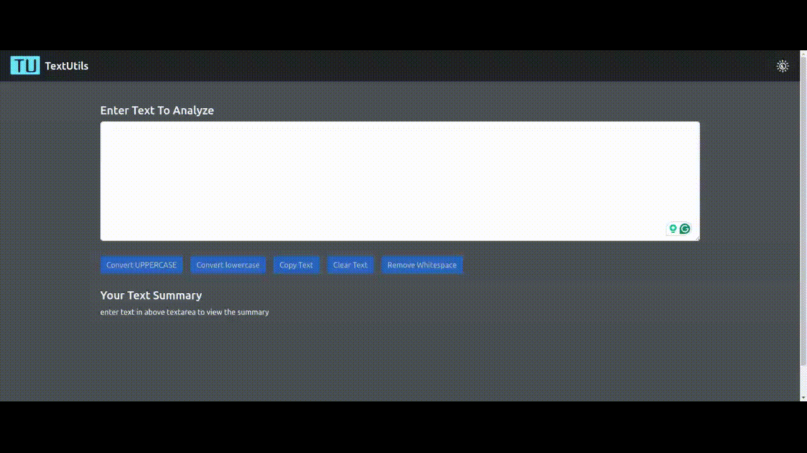

# TextUtils

Welcome to the TextUtils GitHub repository!

TextUtils is a simple text utility site built in React, It allows user to perform various operations on text like converting to upper case,lower case,remove white space.



## Installation

- Clone the repository:

```bash
  git clone https://github.com/swapnilghone/textutils.git
```
- Navigate to the project directory:
```bash
  cd textutils
```
- Install dependencies:
```bash
  npm install
```
## Usage

- To start the project:
```bash
npm run start
```
- To build the project:
```bash
npm run build
```

## Dependencies
- Node version: >=20.11.0
- Npm version: >=0.39.1
- React version: 18.2

## License

TextUtils is licensed under the MIT License - see the [LICENSE.TXT](LICENSE.TXT) file for details


## Authors

**Swapnil Ghone** - [TextUtils](https://github.com/swapnilghone/textutils)


## 🔗 Links
[](https://github.com/swapnilghone)

[](https://www.linkedin.com/in/swapnil-ghone/)

## Contributing

Contributions are always welcome!

Please feel free to fork the repository and submit pull requests.